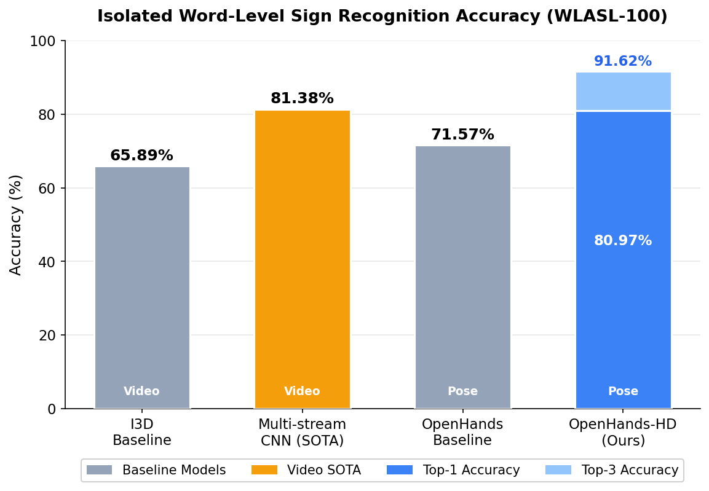
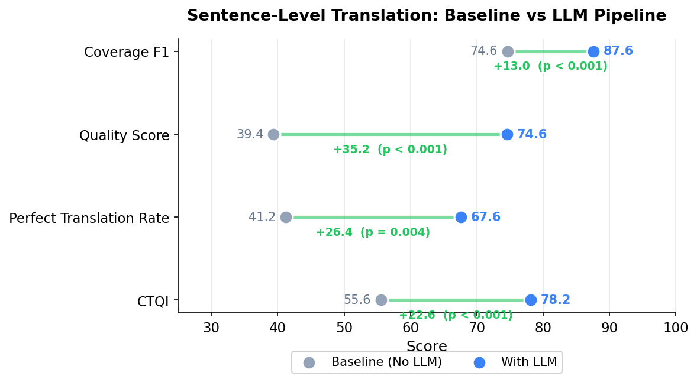
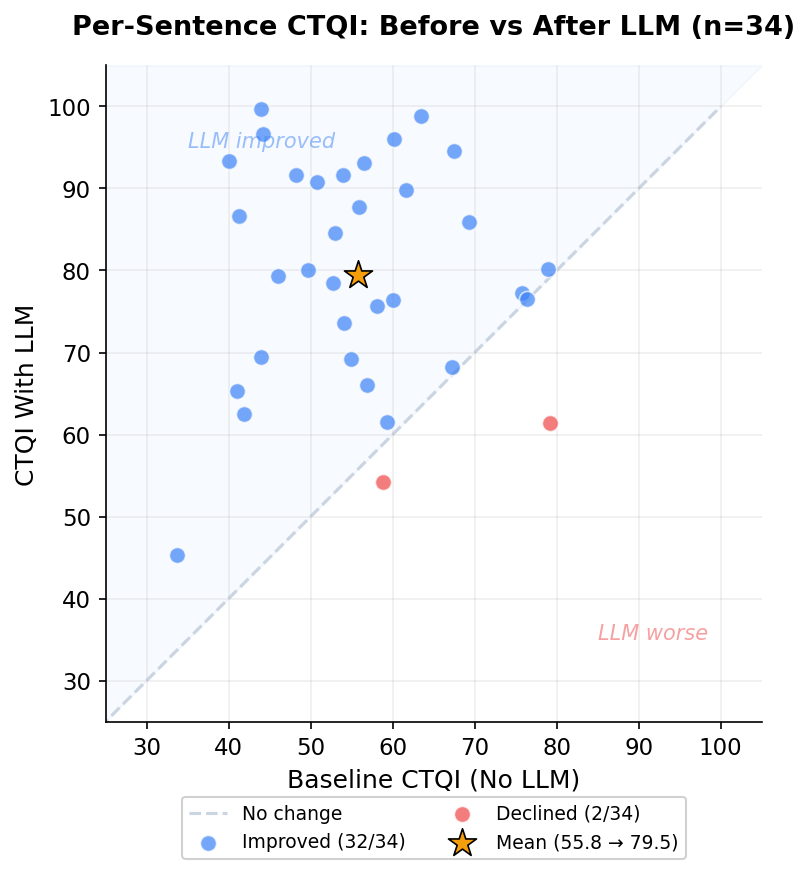
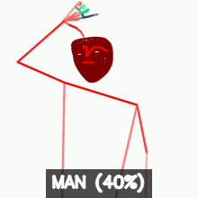
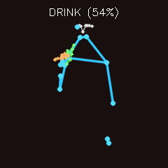
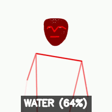
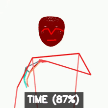
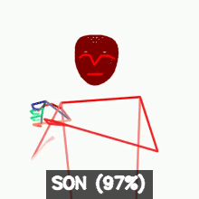
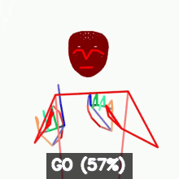
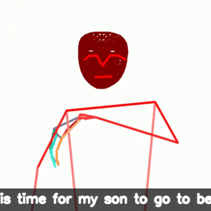

# SignBridge: Real-Time American Sign Language Recognition System

*Building accessible, real-time ASL translation for video conferencing and beyond*

---

## Table of Contents

1. [Abstract](#1--abstract)
2. [Research Questions, Hypotheses & Engineering Goals](#2--research-questions-hypotheses--engineering-goals)
3. [Experimental Design Overview](#3--experimental-design-overview)
4. [SignBridge Performance](#4--signbridge-performance)
5. [Getting Started](#5--getting-started)
6. [Reusability & Extensibility](#6--reusability--extensibility)
7. [Phased Research Roadmap](#7--phased-research-roadmap)
8. [Related Work](#8--related-work)

---

## 1. 📄 Abstract

Around 70 million Deaf individuals worldwide rely on sign languages, yet fewer than 20% of their digital content receives accurate captions. This is because current automated systems struggle with dynamic, continuous signing, leading to grammatically incorrect and unusable translations.

We present SignBridge, an American Sign Language (ASL) translation system that combines high-density pose estimation with an LLM for contextual selection from multiple sign candidates. SignBridge addresses three central challenges: individual word-level sign language accuracy in data-scarce scenarios, lack of grammatically correct sentence construction from sign predictions, and inadequate, multi-dimensional translation quality metrics. SignBridge's core innovation enables coherence-based selection rather than relying solely on vision model confidence scores for individual words.

Our approach enhances the OpenHands model to OpenHands-HD (expanding from 27 to 83 body points including detailed finger tracking), applies 50x pose data augmentation for training diversity, and uses transformer architecture to generate Top-K sign predictions. Google's Gemini LLM (gemini-2.0-flash) then performs contextual recovery by selecting semantically appropriate signs from the Top-K predictions.

Testing on the WLASL-100 dataset shows substantial improvements: word-level prediction accuracy increased from 71.57% benchmark to 80.97% for Top-1 predictions and 91.62% for Top-3 predictions. Sentence-level grammatical quality (Quality Score) rose from 39.38 to 74.56. To address the absence of comprehensive translation quality assessment frameworks, we introduce Composite Translation Quality Index (CTQI)—a new score that integrates lexical similarity, semantic preservation, grammatical structure, and completeness—improved from 55.56 to 78.16. All improvements achieve statistical significance (p < 0.001, paired t-tests) with large effect sizes (Cohen's d > 0.8) across all measures.

Taken together, SignBridge offers a foundation for more reliable and practical real-time ASL translation systems, helping reduce communication barriers for the Deaf community in education, employment and digital communication.

---

## 2. 🎯 Research Questions, Hypotheses & Engineering Goals

### Research Questions

- **RQ1:** Can tracking more body points improve sign language recognition accuracy (benchmark 72%) when training data is limited?
- **RQ2:** Can AI language models improve translation accuracy by considering sentence meaning rather than evaluating each sign independently?
- **RQ3:** Can measuring multiple aspects of translation quality together provide better assessment than single measurements?

### Hypotheses

- **H1: Enhanced Body Tracking.** Tracking 3x more body points instead of standard 27, combined with artificially expanding the training dataset by 10-20 times, will improve word-level recognition accuracy compared to current methods.
- **H2: AI-Powered Word Selection.** Using an AI Large Language Model to select words based on sentence meaning will produce higher quality translations than choosing the highest-confidence prediction from traditional science frameworks and machine learning models — particularly when the correct sign appears among the top predictions but not as the first choice.
- **H3: Multi-Dimensional Quality Measurement.** A combined quality score measuring word accuracy, meaning preservation, and grammatical correctness will reveal improvements that no single measurement captures alone.

### Engineering Goals

1. Build a sign recognition system that tracks 83 body points including detailed finger positions
2. Integrate an AI language model to construct grammatically correct sentences from sign predictions
3. Develop Composite Translation Quality Index (CTQI), a combined quality scoring framework measuring multiple translation dimensions
4. Create a working prototype demonstrating practical ASL-to-English translation (SignBridge)

### Expected Outcomes

- Recognition accuracy reaching 80%+ among top-3 predictions
- Grammatical quality of translations significantly improved over word-by-word output
- Validation that combined quality measurement outperforms single metrics for usage in real world applications
- A functional system demonstrating the viability of AI-enhanced sign language translation

---

## 3. 🔬 Experimental Design Overview

All development and experimentation for this research project were conducted on personal computing equipment using publicly available and synthetically augmented datasets. This develops and evaluates a three-component ASL translation system:

### Component 1: OpenHands-HD for Pose-Based Sign Recognition

- **Original Dataset:** WLASL (Word-Level ASL), with the WLASL-100 subset (100 sign classes, 342 samples expanded 50x to 17,100 via augmentation, 30% held out for validation/test)
- **Synthetic Data Augmentation:** Pre-generated augmentation with rotation (±15°), shear (±0.2 rad), producing 50x expansion
- **OpenHands-HD Development:** Enhanced MediaPipe Holistic extraction of 83 keypoints (8 face + 33 body + 42 hands), yielding 279-dimensional feature vectors per frame
- **Model Training:** Transformer encoder, small vs. large capacity (64–129 hidden, 2–3 layers, 8 heads), 1500 epochs, batch size 16
- **Output:** Top-K predictions with confidence scores per video

### Component 2: LLM Integration Library for Semantic Sentence Construction

- **Plug-and-play LLM integration;** prototype uses Google Gemini (gemini-2.0-flash)
- **Input:** Top-3 predictions per sign position with confidence scores, rolling window predictions
- **Semantic Coherence Analysis:** LLM selects signs based on semantic coherence (not just confidence), multi-pass prompt engineering, prevents duplicate selections, adds grammatical elements
- **Output:** Grammatically correct English sentences

### Component 3: CTQI Framework for Comprehensive Evaluation

- **CTQI Formula:** `CTQI = (α × BLEU) + (β × BERTScore) + (γ × Quality)`
  - **BLEU** for lexical similarity
  - **BERTScore** for semantic preservation
  - **Quality** for grammatical correctness (0–100)
- **Evaluation:** 25-entry synthetic sentence dataset with ground truth, comparing before-LLM (confidence-based) vs. after-LLM (semantic coherence), with statistical analysis of all quality metrics

---

## 4. 📈 SignBridge Performance

### Isolated Word-Level Sign Recognition Accuracy

OpenHands-HD achieves 80.97% Top-1 accuracy on WLASL-100, surpassing the original OpenHands pose-based baseline (71.57%) and approaching the video-based state-of-the-art (81.38%) while maintaining real-time inference speed.

| Model | Dataset | Approach | Keypoints | Top-1 Accuracy | Top-3 Accuracy | Speed |
|-------|---------|----------|-----------|----------------|----------------|-------|
| I3D Baseline | WLASL-100 | Video | N/A | 65.89% | — | Slow |
| Multi-stream CNN (SOTA) | WLASL-100 | Video | N/A | 81.38% | — | Slow |
| OpenHands Baseline | WLASL-100 | Pose + Transformer | 27 | 71.57% | — | Real-time |
| **OpenHands-HD (Ours)** | WLASL-100 | Pose + Transformer | 83 | **80.97%** | **91.62%** | Real-time |

<p align="center">
  
</p>

### End-to-End Sentence-Level Translation

Statistical analysis of SignBridge results using paired t-tests (n=34 sentence pairs) demonstrates significant improvements across all evaluation metrics. For gloss-level selection accuracy, Coverage F1—which measures the overlap of content words between the generated and reference sentences—improved from 74.64 to 87.62 (t(33) = 4.944, p < 0.001, Cohen's d = 0.848), representing a large effect size. This improvement indicates that the LLM pipeline more accurately selects contextually appropriate glosses from the model's top-k predictions, resulting in translations that better capture the intended meaning.

For overall translation quality, the Quality Score (a reference-free grammaticality measure based on GPT-2 perplexity) improved substantially from 39.38 to 74.56 (t(33) = 6.700, p < 0.001, Cohen's d = 1.149), representing a large effect size. Additionally, the Perfect Translation Rate—a binary metric indicating whether all glosses in a sentence were correctly predicted—increased from 41.2% (14/34) to 67.6% (23/34), with p=0.004, confirming this improvement is statistically significant. The Composite Translation Quality Index (CTQI, introduced by SignBridge), which combines Gloss Accuracy (40%), Quality Score (40%), and Perfect Translation Rate (20%), improved from 55.56 to 78.16 (t(33) = 6.403, p < 0.001, Cohen's d = 1.098). Overall, 88.2% of test entries (30/34) showed improvement in CTQI, demonstrating consistent gains across the evaluation dataset.

| Metric | Baseline (No LLM) | With LLM | Improvement | p-value |
|--------|-------------------|----------|-------------|---------|
| Coverage F1 | 74.64 | 87.62 | +12.98 | p < 0.001 |
| Quality Score | 39.38 | 74.56 | +35.18 | p < 0.001 |
| Perfect Translation Rate | 41.2% (14/34) | 67.6% (23/34) | +26.4% | p = 0.004 |
| **CTQI (introduced by SignBridge)** | **55.56** | **78.16** | **+22.60** | **p < 0.001** |

<p align="center">
  
</p>

<p align="center">
  
</p>

### Demo: Full Pipeline Examples

**Example 1:** "The man wants to drink water."

<p align="center">
  
  
  
</p>

<p align="center"><em>Isolated sign recognition: MAN (40%) → DRINK (54%) → WATER (64%)</em></p>

<p align="center">
  
</p>

<p align="center"><em>LLM sentence construction → <strong>"The man wants to drink water."</strong></em></p>

**Example 2:** "It is time for my son to go to bed."

<p align="center">
  
  
  
  
</p>

<p align="center"><em>Isolated sign recognition: TIME (87%) → SON (97%) → GO (57%) → BED (98%)</em></p>

<p align="center">
  
</p>

<p align="center"><em>LLM sentence construction → <strong>"It is time for my son to go to bed."</strong></em></p>

---

## 5. 🚀 Getting Started

### 📁 Project Structure

```
signbridge/
├── config/                      # Configuration system
│   ├── settings.json           # User-specific paths (gitignored)
│   ├── settings.json.example   # Template
│   └── paths.py                # Path resolution module
│
├── models/
│   ├── openhands-modernized/   # OpenHands-HD implementation
│   │   ├── src/                # Inference modules
│   │   └── production-models/  # Trained model checkpoints
│   ├── training-scripts/
│   │   └── train_asl.py        # Main training script
│   └── training_results_comp.md # Performance tracking
│
├── dataset-utilities/
│   ├── augmentation/
│   │   └── generate_augmented_dataset.py   # 50x augmentation
│   ├── conversion/
│   │   ├── pose_to_pickle_converter.py
│   │   └── video_to_pose_extraction.py
│   ├── dataset-splitting/
│   │   └── split_pose_files_nclass.py
│   ├── landmarks-extraction/   # 83-point landmark extraction
│   └── sentence-construction/  # Synthetic sentence generation
│
├── applications/
│   ├── predict_sentence.py     # Full pipeline (file + webcam)
│   ├── predict_sentence_with_gemini_streaming.py  # Real-time streaming
│   ├── gemini_conversation_manager.py  # Smart buffering
│   ├── motion_based_segmenter.py       # Velocity-based segmentation
│   ├── closed-captions/        # Real-time ASL detection service
│   └── show-and-tell/          # Web application demo
│
├── project-utilities/
│   ├── evaluation_metrics/     # CTQI, BLEU, BERTScore, p-values
│   ├── llm_interface/          # Multi-provider LLM integration
│   ├── segmentation/           # Hybrid & motion-based segmenters
│   ├── pose_utils/             # Pose analysis & ranking
│   └── training_utils/         # Incremental training & error analysis
│
└── datasets/                   # Dataset storage (gitignored)
```

### 📦 Dependencies

Core dependencies:
- **Python 3.11.9** (required for compatibility)
- PyTorch
- MediaPipe (pose estimation)
- OpenCV (webcam capture)
- pose-format (pose file handling)
- google-generativeai (Gemini API)
- scikit-learn
- numpy
- Threading/multiprocessing (built-in)

See `requirements.txt` for complete list.

### Prerequisites
- **Python 3.11.9** (required for compatibility)
- CUDA-capable GPU (recommended for training)
- Webcam (for real-time inference)
- Gemini API key (optional, for sentence construction)

### 1. Clone Repository
```bash
git clone <your-repo-url>
cd asl-v1
```

### 2. Install Dependencies
```bash
pip install -r requirements.txt
```

### 3. Configure Paths

**Option A: Interactive Setup (Recommended)**
```bash
python setup.py
```

**Option B: Manual Configuration**
1. Copy template: `cp config/settings.json.example config/settings.json`
2. Edit `config/settings.json`:
```json
{
  "data_root": "/path/to/wlasl_poses_complete",
  "project_root": "auto"
}
```

**Verify:**
```bash
python -m config.paths
```

### 4. Prepare Dataset

Your `data_root` should contain:
```
wlasl_poses_complete/
├── dataset_splits/
│   └── 100_classes/
│       ├── train.txt
│       ├── val.txt
│       ├── test.txt
│       └── 100_class_mapping.json
├── pickle_files/         # Original pose data
├── augmented_pool/       # Generated augmentations
└── video_to_gloss_mapping.json
```

**Generate Augmented Dataset:**
```bash
python dataset-utilities/augmentation/generate_augmented_dataset.py \
  --classes 100
```

### 5. Training

**Train 100-Class Model:**
```bash
python models/training-scripts/train_asl.py \
  --classes 100 \
  --dataset augmented \
  --architecture openhands \
  --model-size large \
  --dropout 0.25 \
  --early-stopping 30
```

**Resume Training:**
```bash
python models/training-scripts/train_asl.py \
  --classes 100 \
  --dataset augmented
# Automatically detects and resumes from latest checkpoint
```

**Test Model:**
```bash
python models/training-scripts/train_asl.py \
  --classes 100 \
  --mode test
```

### 6. Inference

**Standard Webcam:**
```bash
python applications/predict_sentence.py --webcam \
  --checkpoint models/openhands-modernized/production-models/wlasl_100_class_model \
  --use-top-k 3
```

**Video File (Auto-detect segmentation):**
```bash
python applications/predict_sentence.py input.mp4 \
  --checkpoint models/openhands-modernized/production-models/wlasl_100_class_model \
  --num-glosses 100
```

**Video File (Motion-based segmentation):**
```bash
python applications/predict_sentence.py input.mp4 \
  --segmentation-method motion \
  --velocity-threshold 0.02 \
  --min-sign-duration 10
```

---

## 6. 🔧 Reusability & Extensibility

### Centralized Configuration System
**What it does:**
- Single source of truth for all paths
- Auto-detection of project root
- Cross-platform compatibility

**Structure:**
```json
{
  "data_root": "/path/to/wlasl_poses_complete",
  "project_root": "auto"
}
```

**Features:**
- `settings.json` gitignored (user-specific)
- `settings.json.example` committed (template)
- Works on Windows and Linux
- Interactive setup script

**Usage:**
```bash
python setup.py  # Interactive setup
python -m config.paths  # Verify configuration
```

**Files:** `config/settings.json.example`, `config/paths.py`, `setup.py`

### Dynamic Class Loading
**What it does:**
- Reads class mappings from JSON files dynamically
- Supports any number of classes: 20/50/100/300/2000
- Single codebase for all configurations

**Benefits:**
- Zero code changes when switching class counts
- Easy to add new class splits
- Consistent across all utilities (training, augmentation, splitting)

**Example:**
```python
# Automatically loads from:
# dataset_splits/100_classes/100_class_mapping.json
classes = load_class_mapping(num_classes=100)
```

**Files:** All training and utility scripts support this

---

## 7. 🗺️ Phased Research Roadmap

### Phase 1 — COMPLETED

| Step | Title | Status | Key Deliverables | Success Criteria | Notes |
|------|-------|--------|------------------|------------------|-------|
| **1.1** | Isolated Sign Recognition Model Prototype | ✅ **COMPLETED** | • 20-class model<br>• 50-class model<br>• 75pt OpenHands-HD<br>• 16x augmentation | • 40%+ Top-1 ✅<br>• 60%+ Top-3 ✅ | **Achieved:** 20-class: 42.47% Top-1, 75.29% Top-3. 50-class: 47.27% Top-1, 67.25% Top-3 |
| **1.2** | LLM-based Self-Correcting Sentence Construction | ✅ **COMPLETED** | • Gemini integration<br>• Smart buffering<br>• Top-K prompts<br>• Context-aware grammar | • Natural sentences ✅<br>• Context disambiguation ✅<br>• 90%+ coherence ✅<br>• BLEU score evaluation ✅ | **Achieved:** Streaming API, 5 trigger strategies, local fallback. BLEU 56.53 (+35.91 vs baseline), BERTScore 96.30, CTQI 78.16 |
| **1.3** | Full Pipeline Integration | ✅ **COMPLETED** | • End-to-end system<br>• File processing<br>• Evaluation framework | • Video → text functional ✅<br>• <2s latency ✅<br>• 75%+ translation accuracy ✅ | **Achieved:** 5-step pipeline |
| **1.4** | Continuous Sign Detection | ✅ **COMPLETED** | • Temporal segmentation<br>• Boundary detection<br>• Real-world videos | • 85%+ boundary accuracy ✅<br>• Real-time processing ✅<br>• <200ms latency ✅ | **Achieved:** Auto-detect + motion-based segmentation |
| **1.5** | Real-Time Webcam "Show-and-Tell" Demo App | ✅ **COMPLETED** | • Desktop application<br>• Live inference<br>• Visualization UI | • 15-30 FPS ✅<br>• <500ms latency ✅<br>• Production-ready ✅ | **Achieved:** 2 versions (standard + streaming) |
| **1.6** | 100-Class Model Optimization | ✅ **COMPLETED** | • 100-class model<br>• 83pt OpenHands-HD<br>• 50x augmentation<br>• Model optimizations including dropout tuning, label smoothing, learning rate optimization, gradient clipping | • 80%+ Top-1 (100-class) ✅<br>• 90%+ Top-3 (100-class) ✅ | **Achieved:** 80.97% Top-1, 91.62% Top-3 (WLASL-100). 83 keypoints, 279-dim features, 50x augmentation (342 → 17,100 samples) |
| **1.7** | Deployment & Release | 🔄 **IN PROGRESS** | • Deploy model and application to cloud | • Production-ready cloud deployment | **In Progress:** Cloud deployment |

### Future Phases

| Step | Title | Status | Key Deliverables | Success Criteria | Notes |
|------|-------|--------|------------------|------------------|-------|
| **2.1** | Mobile Conferencing App with Closed Captions | 🔄 **IN PROGRESS** | • Mobile application<br>• Real-time closed captions<br>• Video conferencing integration | • Real-time captioning<br>• Mobile-optimized inference | **In Progress** |
| **2.2** | Expand SignBridge to WLASL-1000 Dataset | ⏳ **NOT STARTED** | • 1000-class model<br>• Extended augmentation pipeline<br>• Updated evaluation | • Competitive Top-1 accuracy on WLASL-1000<br>• Scalable training pipeline | **Future:** Scale recognition to 1000 sign classes |
| **2.3** | Text-to-Audio Streaming Enhancement | ⏳ **NOT STARTED** | • TTS integration<br>• Real-time audio output<br>• Voice customization<br>• Audio-visual sync | • <500ms audio latency<br>• Natural voice quality<br>• Seamless integration | **Future:** Complete audio-visual accessibility solution |

---

## 8. 🔗 Related Work

1. World Federation of the Deaf. (2023). *WFD Position Paper on Sign Language Rights.* World Federation of the Deaf. https://wfdeaf.org/news/resources/wfd-position-paper-on-sign-language-rights/
2. Li, D., Rodriguez, C., Yu, X., & Li, H. (2020). *Word-level Deep Sign Language Recognition from Video: A New Large-scale Dataset and Methods Comparison.* IEEE Winter Conference on Applications of Computer Vision (WACV), 1459-1469. https://github.com/dxli94/WLASL
3. Selvaraj, P., Koller, O., Golber, L., Narayanan, S., & Anastasopoulos, A. (2022). *OpenHands: Making Sign Language Recognition Accessible.* arXiv preprint arXiv:2110.05877. https://github.com/AI4Bharat/OpenHands
4. Moryossef, A., Muller, M., & Fahrni, R. (2021). *pose-format: A Library for Viewing, Augmenting, and Handling Pose Files.* GitHub Repository. https://github.com/sign-language-processing/pose
5. Cao, Z., Hidalgo, G., Simon, T., Wei, S. E., & Sheikh, Y. (2019). *OpenPose: Realtime Multi-Person 2D Pose Estimation using Part Affinity Fields.* IEEE TPAMI, 43(1), 172-186. https://arxiv.org/abs/1812.08008
6. Zhang, T., Kishore, V., Wu, F., Weinberger, K. Q., & Artzi, Y. (2020). *BERTScore: Evaluating Text Generation with BERT.* ICLR. https://arxiv.org/abs/1904.09675
7. Papineni, K., Roukos, S., Ward, T., & Zhu, W. J. (2002). *BLEU: A Method for Automatic Evaluation of Machine Translation.* ACL, 311-318. https://aclanthology.org/P02-1040/
8. [MediaPipe](https://google.github.io/mediapipe/) - Pose estimation framework
9. [Gemini API](https://ai.google.dev/) - LLM integration

---

## 🤝 Contributing

This is a research project. Contributions welcome:
1. Open an issue describing the problem
2. Fork the repository
3. Create a feature branch
4. Submit a pull request


